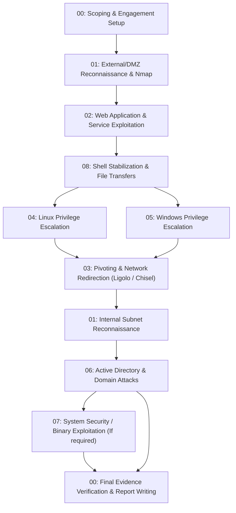

# INE CPPT (Certified Professional Penetration Tester) Exam Cheatsheet

Welcome to the **eCPPT Exam Preparation & Reference Suite**. This repository is structured into modular, field-tested technical guides covering the entire **eCPPTv3 / eCPPT** curriculum from initial scoping to professional reporting.

---

## 🗺️ Exam Workflow Architecture

---

## 📚 Modular Guides Directory

| #      | Module Document                                                                                            | Primary Exam Domains Covered                                                            | Key Tools & Techniques                                                           |
| ------ | ---------------------------------------------------------------------------------------------------------- | --------------------------------------------------------------------------------------- | -------------------------------------------------------------------------------- |
| **01** | [01-Reconnaissance-and-Enumeration.md](01-Reconnaissance-and-Enumeration.md)   | Host discovery, port scanning, service probing, banner grabbing, OSINT                  | `nmap`, `masscan`, `netexec`, `enum4linux-ng`, `snmpwalk`, `rpcclient`           |
| **02** | [02-Web-and-API-Security-Testing.md](02-Web-and-API-Security-Testing.md)                                   | Directory fuzzing, SQLi, LFI/RFI to RCE, upload bypasses, command injection, SSRF, APIs | `ffuf`, `gobuster`, `sqlmap`, Burp Suite, PHP wrappers, log poisoning            |
| **03** | [03-Pivoting-Tunneling-and-Port-Forwarding.md](03-Pivoting-Tunneling-and-Port-Forwarding.md)               | Multi-subnet routing, reverse tunnels, SOCKS proxies, port redirection                  | `ligolo-ng`, `chisel`, `proxychains`, `ssh` (-L/-R/-D), `socat`, `netsh`         |
| **04** | [04-Linux-Privilege-Escalation.md](04-Linux-Privilege-Escalation.md)                                       | Linux enumeration, SUID/SGID, sudo rules, cron jobs, capabilities, NFS squashing        | `LinPEAS`, GTFOBins, `sudo -l`, `/etc/passwd` injection, shared libraries        |
| **05** | [05-Windows-Privilege-Escalation.md](05-Windows-Privilege-Escalation.md)                                   | Windows services, unquoted paths, Potato exploits, stored creds, DPAPI, UAC bypass      | `WinPEAS`, `PrintSpoofer`, `GodPotato`, `Seatbelt`, `PowerUp`, `accesschk`       |
| **06** | [06-Active-Directory-Attacks-and-Lateral-Movement.md](06-Active-Directory-Attacks-and-Lateral-Movement.md) | LLMNR poisoning, Kerberoasting, AS-REP, BloodHound, Pass-the-Hash, DCSync               | `Responder`, `BloodHound`, `SharpHound`, `secretsdump`, `mimikatz`, `evil-winrm` |
| **07** | [07-Binary-Exploitation-and-Buffer-Overflow-Guide.md](07-Binary-Exploitation-and-Buffer-Overflow-Guide.md) | 32-bit x86 stack overflow, Mona commands, EIP overwrite, bad chars, shellcode           | Immunity Debugger, `mona.py`, `msfvenom`, `pattern_offset`, Python sockets       |
| **08** | [08-Shell-Stabilization-and-File-Transfers.md](08-Shell-Stabilization-and-File-Transfers.md)               | Interactive TTY upgrading, reverse shell generators, Windows/Linux transfers            | `pty`, `stty`, `certutil`, PowerShell cradles, `impacket-smbserver`, `curl`      |
